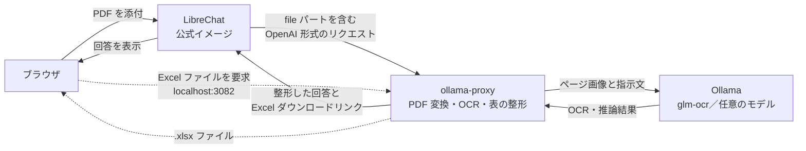

# LibreChat OCR Bridge

LibreChat と Ollama の間でリクエストを変換するサイドカーコンテナです。スキャンした PDF をチャットに添付するだけで、OCR、表形式への変換、Excel ファイルの作成まで行えます。LibreChat 本体を変更する必要はありません。



## 解決する問題

LibreChat は、添付された PDF を OpenAI 形式の `file` パートとして送信します。一方、Ollama の OpenAI 互換 API は画像のみを受け付けるため、そのまま送信すると `400 invalid message format` エラーが発生します。

このプロキシは、LibreChat から送られたリクエストを Ollama が処理できる形式に変換してから転送します。

## 機能

| 送信先モデル | 処理内容 |
| --- | --- |
| OCR モデル（`OCR_MODELS`。例：`glm-ocr`） | PDF をページごとに画像化し、1 ページずつ OCR を実行します。指示文は `Text / Table / Formula Recognition:` のいずれかに自動変換されます（例：「表にして」→ `Table`）。「1ページ目」などのページ指定にも対応しています。 |
| ビジョンモデル | PDF をページごとの画像に変換して渡します。 |
| テキストモデル | PDF からテキストを抽出して渡します。スキャンされたページは、事前に OCR モデルで読み取ります。 |

OCR の結果には、次の処理を行います。

- **ループの検知**：小規模な OCR モデルが表の出力後に同じ文字列を繰り返した場合、生成を停止し、重複部分を取り除きます。
- **表の変換**：HTML 形式の表を Markdown 形式に変換し、LibreChat 上で表として表示します。
- **項目名の推定**：見出し行がない表では、各列の値の形式をルールに基づいて判定し、適切と思われる項目名を見出しとして追加します。たとえば、`2026/07/06` のような値を含む列には「日付」、`100-0001` のような値を含む列には「郵便番号」を設定します。判定できない列には `列N` を設定します。判定ルールは `proxy/headers.py` で追加・変更できます。
- **Excel ファイルの出力**：結合セル、太字の見出し、文字列形式の電話番号などを保持した `.xlsx` ファイルを作成し、回答にダウンロードリンクを追加します。

## ディレクトリ構成

```text
librechat-ocr-bridge/
├── proxy/
│   ├── app.py
│   │   ├── OpenAI 互換リクエストの中継
│   │   ├── PDF のページ画像への変換
│   │   ├── OCR の実行
│   │   └── Excel ファイルの配信
│   │
│   ├── tables.py
│   │   ├── HTML 表から Markdown 表への変換
│   │   └── Excel ファイルの作成
│   │
│   └── headers.py
│       └── 見出し行がない表の項目名を推定
│
├── librechat/
│   ├── docker-compose.override.yml
│   │   └── ollama-proxy のコンテナ設定
│   │
│   └── librechat.yaml
│       └── Ollama エンドポイントと添付ファイルの設定
│
└── tests/
    └── プロキシの単体テスト
```

## セットアップ

### 前提条件

- Docker がインストールされていること
- ホスト上で Ollama が動作していること
- `ollama pull glm-ocr` を実行し、OCR モデルを取得していること
- LibreChat の公式 Docker 構成を使用すること

LibreChat と本リポジトリを同じディレクトリ階層に配置します。

```sh
git clone https://github.com/danny-avila/LibreChat.git
git clone <this repo> librechat-ocr-bridge

cd LibreChat
cp .env.example .env          # 秘密鍵などを設定
cp ../librechat-ocr-bridge/librechat/docker-compose.override.yml .
cp ../librechat-ocr-bridge/librechat/librechat.yaml .
docker compose up -d --build
```

起動後、[http://localhost:3080](http://localhost:3080) を開き、モデル選択画面で **Ollama → glm-ocr** を選択して PDF を添付します。

### `librechat.yaml` の主な設定

```yaml
endpoints:
  allowedAddresses: ['ollama-proxy:8080']   # LibreChat の SSRF 対策で許可するアドレス
  custom:
    - name: "Ollama"
      baseURL: "http://ollama-proxy:8080/v1/"

fileConfig:
  endpoints:
    Ollama:
      supportedMimeTypes: ["image/.*", "application/pdf"]
```

## 設定（環境変数）

| 変数 | 既定値 | 説明 |
| --- | --- | --- |
| `OLLAMA_UPSTREAM` | `http://host.docker.internal:11434` | Ollama の URL |
| `OCR_MODELS` | `glm-ocr` | OCR モードとして扱うモデル名。複数指定する場合はカンマで区切ります。タグの指定は不要です。 |
| `OCR_FALLBACK_MODEL` | `glm-ocr:latest` | テキストモデルを使用するときに、スキャンされたページを読み取るためのモデル。空にすると無効になります。 |
| `PDF_DPI` / `PDF_MAX_PAGES` | `200` / `20` | ページ画像の解像度と、処理する最大ページ数 |
| `OCR_MAX_TOKENS` | `8192` | 1 ページあたりの最大出力トークン数 |
| `SCAN_IMAGE_COVERAGE` | `0.5` | ページ全体に占める画像領域の割合がこの値以上の場合、そのページをスキャン画像とみなします。 |
| `TABLE_AUTO_HEADER` | `true` | 表の項目名を自動的に推定するかどうか |
| `PUBLIC_BASE_URL` | `http://localhost:3082` | ブラウザからアクセスする Excel ファイルのダウンロード URL |
| `EXPORT_TTL_HOURS` | `72` | 作成した Excel ファイルの保存期間（時間） |

## テスト

最初に、LibreChat のディレクトリでプロキシのイメージをビルドします。

```sh
docker compose build ollama-proxy
```

続いて、本リポジトリのディレクトリに移動して単体テストを実行します。

```sh
cd ../librechat-ocr-bridge
docker run --rm -v "$PWD":/w -w /w/proxy librechat-ollama-proxy:local \
  python -m unittest discover -s ../tests
```

## 注意事項

- ダウンロード用ポート `3082` は、既定では `127.0.0.1` にのみ公開されます。ほかの端末から利用する場合は、`PUBLIC_BASE_URL` とポートの公開範囲を見直してください。
- 項目名の推定はルールベースで行います。そのため、表の形式や値の書式によっては、適切な項目名を推定できない場合があります。

## ライセンス

本リポジトリで独自に作成したコードは、[MIT License](https://github.com/chiisanasoft/librechat-ocr-bridge/blob/main/LICENSE) の下で公開しています。主に個人環境やローカル環境での利用を想定しています。

### 依存ライブラリのライセンス

PDF の処理には [PyMuPDF](https://github.com/pymupdf/PyMuPDF) を使用しています。PyMuPDF は、[GNU AGPL v3](https://www.gnu.org/licenses/agpl-3.0.html) または [Artifex 社の商用ライセンス](https://pymupdf.io/licensing)で提供されています。

- 自分の環境内だけで使用し、第三者への配布やサービス提供を行わない場合は、通常、ソースコードの提供は必要ありません。
- PyMuPDF を含むコンテナイメージやアプリケーションを配布する場合、またはネットワーク経由で第三者に提供する場合は、AGPL に基づくソースコードの提供が必要になることがあります。
- ソースコードを公開せずに配布またはサービス提供したい場合は、Artifex 社の商用ライセンスを利用するか、PyMuPDF を別のライブラリへ置き換えてください。

代替ライブラリとしては、Apache-2.0 または BSD-3-Clause で提供されている [pypdfium2](https://github.com/pypdfium2-team/pypdfium2) を利用できます。置き換える場合は、主に `proxy/app.py` のページ画像化、テキスト抽出、スキャン判定の処理を変更する必要があります。

そのほかの主要な依存ライブラリである Starlette、uvicorn、httpx、openpyxl は、MIT または BSD 系のライセンスで提供されています。
